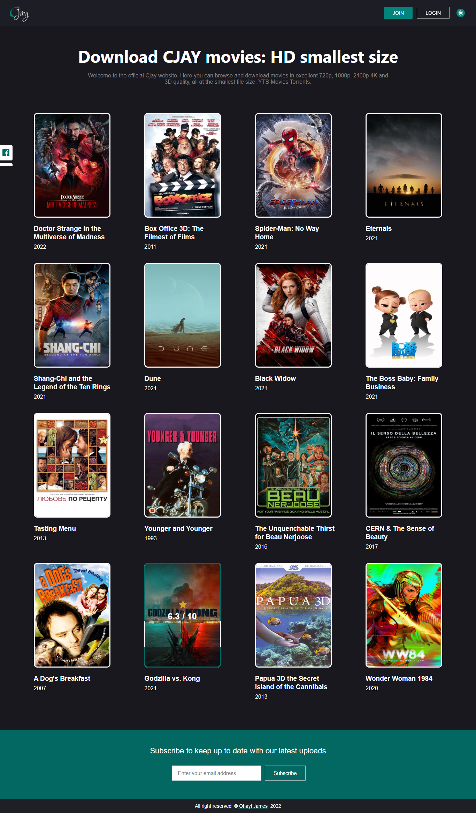
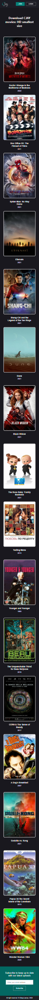

## DEVCAREER LAPTOP4DEV COHORT 3 👋
### TEAM 3 (MOVIE API CHALLENGE)

### A MOVIE API WEBPAGE

## Table of contents

- [Overview](#overview)
  - [The challenge](#the-challenge)
  - [Screenshot](#screenshot)
  - [Links](#links)
- [Author](#author)

## Overview

### The challenge

Users should be able to:

- View the optimal layout for the site depending on their device's screen size
- Click on any of the movie title or picture and be taken to summary/synoptic/Movie Details page
- Click on the arrow back button on the movie details page and be taken to the home page
- Hover on each movie-image and see the rating of the movie.
- Use the dark/light mode feature
- View the different state of the page
- Subscribe to the page

### Screenshot
- Desktop View
;

- Mobile View
;

### Links
- Live Site URL: [CLICK TO VIEW THE LIVE SITE ON NETLIFY](https://cjay-peppy.netlify.app/)

## Author

- Website - [OHAYI JAMES CHUKWUKA](https://calculus001.netlify.app);
- Twitter - [@ohayijames](https://www.twitter.com/ohayijames)
